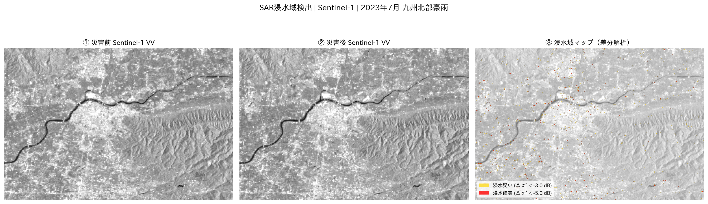

# 🛰️ SAR衛星データによる浸水・災害リスク可視化ポートフォリオ

> **このリポジトリについて**  
> QPS研究所の国内セールス職への応募にあたり、作成した学習・探索目的のポートフォリオです。  
> 衛星データ解析は現在学習中であり、技術的な完成度よりも**「どの顧客のどの課題をQPS-SARで解決できるか」という提案の思考プロセス**を見ていただければ幸いです。  
> コードの実装にはAIツールを活用しています。処理の意図と提案ロジックは自分の言葉で説明できます。

---

## 📌 なぜこのユースケースを選んだか

QPSホールディングスの決算資料・有価証券報告書を読む中で、**現在の売上の93%以上が官公庁・JAXAであり、官公庁が最大の顧客層であることを確認しました。** 中でも防衛省・国交省・内閣府との複数の大型契約が実績として積み上がっています。

一方で、民間向け売上はまだほぼゼロの段階であり、「官公庁需要から民間需要への転換」がQPSの今期最大の経営課題です。この文脈で、**官公庁での実績が民間（三井住友海上火災保険など資本パートナー）への展開に直結する防災ユースケースを選びました。**

日本は台風・豪雨・地震が多発する国です。災害発生時に「どこがどの程度浸水しているか」を素早く把握することは、避難指示や救助の優先順位を決める上で最も重要な情報の一つです。

ところが現状では、**台風や豪雨のときに限って光学衛星は雲に阻まれて使えない**という根本的な矛盾があります。さらに近年は、SNSに流れる真偽不明の情報（過去の被害映像の転用・AIが生成した架空画像・意図的な偽情報など）が錯綜し、担当者の状況判断をさらに難しくするケースも増えています。

SARはこの課題を解決できる技術であり、その中でもQPS-SARのコンステレーション（高頻度・高分解能）は既存SARと比べて大きな優位性を持つと理解しています。

このポートフォリオを作った目的は2つです。

1. **自分がQPS-SARの価値をどう理解しているかを示すこと**
2. **顧客課題から提案を組み立てる思考プロセスを見せること**

技術の深い理解はこれから身につけていきます。まず「なぜこのユースケースなのか」という営業の起点となる仮説を、自分の頭で考えたことを示したいと思っています。

---

## 📂 リポジトリ構成

```
.
├── README.md                          ← このファイル（提案の思考プロセス）
├── proposal.md                        ← 国交省・自治体向け仮想営業提案資料
├── analysis_gee.ipynb                 ← Google Earth EngineでSAR浸水域検出を試みるNotebook
├── customer_industry_understanding.md ← 顧客業界理解メモ（防災・港湾）
├── why_i_am_needed.md                 ← なぜ私がQPSに必要かを述べた自己PR
├── images/
│   └── flood_detection_result.png    ← 実データによる解析結果
└── requirements.txt                   ← 必要パッケージ一覧
```

---

## 🚀 クイックスタート

### Google Colabで実行（推奨）

ローカル環境のセットアップ不要で、ブラウザ上でそのまま実行できます。

1. [Google Colab](https://colab.research.google.com) を開く
2. `analysis_gee.ipynb` をアップロード
3. セルを上から順番に実行
4. 初回のみGoogleアカウントでGEE認証が必要です

### GEEプロジェクトの準備

1. [GEE公式サイト](https://earthengine.google.com) で無料アカウントを作成
2. Google Cloud Console でプロジェクトを作成
3. Earth Engine API を有効化
4. Notebookの `project='your-project-id'` を自分のプロジェクトIDに書き換える

---

## 🔬 使用技術

| カテゴリ | 使用技術 |
|----------|----------|
| 衛星データ取得・処理 | Google Earth Engine（Python API） |
| インタラクティブ可視化 | `geemap` |
| 数値処理・可視化 | `numpy`, `matplotlib` |
| 日本語フォント | `japanize-matplotlib` |
| 実行環境 | Google Colab（推奨） |
| データ | Sentinel-1 GRD（ESA Copernicus・GEE公開データ・無料） |

---

## 📊 解析の考え方

SARが浸水域の検出に使える理由を自分なりに理解した上でコードを構成しています。

```
水面の特性：
  電波を鏡面反射するため、SAR画像上で非常に暗く映る

検出の仕組み：
  災害前後の画像を比較して、急に暗くなったエリアを浸水域として抽出する

光学衛星との違い：
  台風・豪雨時は必ず曇天になるが、SARは雲を貫通して観測できる
```

処理の細部（dB変換・閾値の設定など）は学習中です。なぜその処理が必要かという意図は理解した上で実装しています。

---

## 🗺️ 解析結果サンプル



> **2023年7月 九州北部豪雨（福岡県久留米市・筑後川流域）**  
> Sentinel-1 SARデータをGoogle Earth Engine上で処理。  
> 災害前後の後方散乱係数差分から浸水域を自動抽出。  
> 中央の黒い帯が筑後川。川沿いを中心に浸水確実エリア（赤）を検出。

---

## 🛰️ QPSが既存SARより優れると考える理由

| 比較軸 | Sentinel-1（本解析） | QPS-SAR（現在：9機運用中） | QPS-SAR（将来：36機体制目標） |
|--------|---------------------|--------------------------|------------------------------|
| 分解能 | 約10m | **46cm〜1m** | **46cm〜1m** |
| 観測頻度（同一地点） | 数日〜1週間 | 段階的に向上中 | **10〜40分間隔を目指す** |
| 夜間・悪天候 | 可 | 可 | 可 |

> ※ QPSホールディングスの2026年5月期第3Q決算資料より。  
> 現在9機が商用運用中。2031年5月期に36機体制を目指しており、機数増加とともに観測頻度も段階的に向上する計画です。

発災直後の「初動判断」に間に合うデータを提供できるようになることがQPS-SARの目指す価値だと考えています。本解析のSentinel-1ベースのパイプラインは、その将来的な活用を想定した試みです。

---

## 📄 営業提案資料

顧客課題の整理・提案ロードマップ・ビジネスインパクトの試算は [`proposal.md`](./proposal.md) をご覧ください。  
顧客業界の理解メモは [`customer_industry_understanding.md`](./customer_industry_understanding.md) をご覧ください。

---

## ⚠️ 注意事項

- 本リポジトリはポートフォリオ目的の個人の学習・探索成果物です
- コードの実装にはAIツールを活用しています
- 浸水面積・影響世帯数の推計はあくまで概算です
- GEEの認証情報はこのリポジトリには含まれていません

---

## 🔗 関連リポジトリ

- **[Repo B: Sentinel-1 × 港湾モニタリング](https://github.com/Mitsuaki-1004/sar-ship-detection-portfolio)**  
  Google Earth Engineを使った船舶動態検出の試み（物流・安全保障向け提案）

---

*作成者：森山　光明 | [GitHub](https://github.com/Mitsuaki-1004)*
